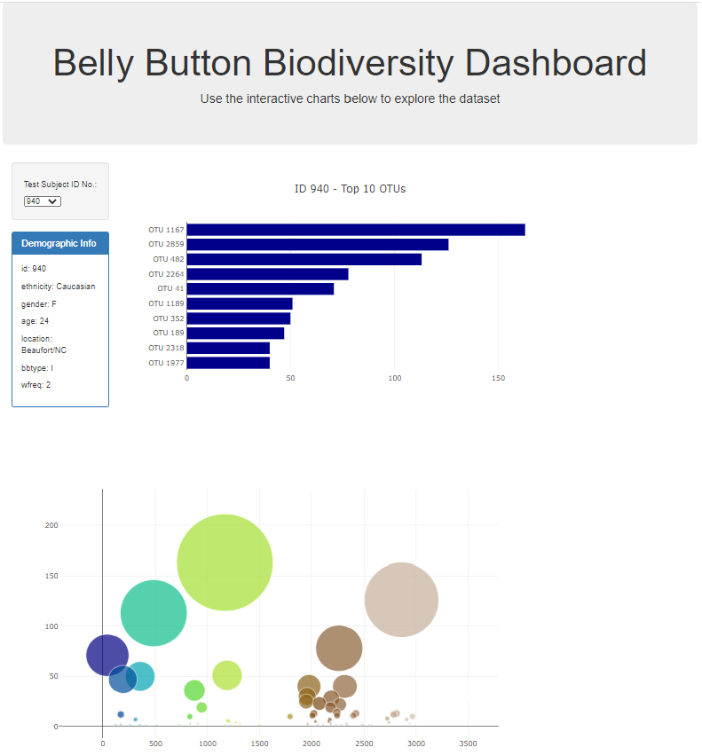

<b>Plot.ly Homework - Belly Button Biodiversity</b> 

<b>Website url: </b> <strong>https://pauline-li.github.io/belly-button-biodiversity/index.html</strong> 

This is an interactive dashboard to explore the Belly Button Biodiversity dataset, which catalogs the microbes that colonize human navels.
The dataset reveals that a small handful of microbial species (also called operational taxonomic units, or OTUs, in the study) were present in more than 70% of people, while the rest were relatively rare.

